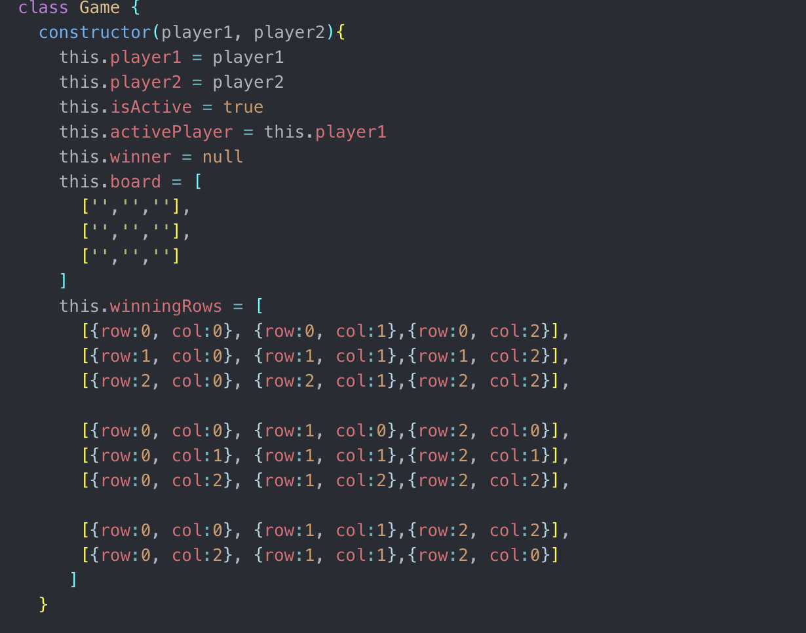

Pre-planning: For the pre planning stage I am thinking the best way of tackling the tic-tac board itself would be to create 9 square boxes set up into columns and rows and then to remove their borders accordingly. This should allow for targeting functionality to occur with relative ease. I am thinking that the cards holding the values of games past will be the only elements that need to be saved to local storage. Otherwise we will work on getting the board working with an array and their position within it. Ideally an array with 9 positions that can then be used to manipulate their value according to the players turn and selection.

Phase 1: Originally we were planning on getting the game working just visually on the page in order to understand the dynamics for how the game would work and then we would wire everything to memory from that learned knowledge. This worked relatively well at first, we got a full game playable however we could not get the winning functionality to work appropriately. We wrote out every single possible combination that a person could possibly win with in tic-tac and when we logged our comparisons they were identical. I have been told that comparing via this method even though the code should be working doesn't, simply because there are too many combinations and the function is too heavy to recognize when a match actually has occurred. Realizing we weren't going to get the winning functionality to occur it was time to nuke all the code and begin again 2 days after project launch. This original strategy had proven to be a mistake.

Phase2: After consulting with a few people and seeing how they had gone about their own winning functionality. I now had an idea of how I would class my game and marks on it in order to make the functionality eventually work. After we got the model running in the DOM and playable in the console via a class key of 'board' which consisted of an array of 3 arrays representing the games rows and columns respectively, like so.
[
  ['','',''],
  ['','',''],
  ['','','']
]
  Once this was playable via the console by inserting coordinate inputs we began to work on the winning functionality once again. This time we took a more sensible (and less time consuming) approach that only involved 8 combinations of wins 6 for each straight line a person could win tic-tac with and another 2 for the diagonals. Once we had this logic down we wrote the functionality that would first check in the case that one of these winning combinations had been met and if it had did all 3 of the marks match one another. A conditional using another conditional if you will. It worked! The game was fully playable via memory now and we had 2 players that were being classed by their player number and X or O marks. Now we had to wire our memory model to the visual representation of the site.

  Phase3: This would prove to be the most difficult part of this project. The first goal was to populate the main playing board with our values from memory in sync. This would immediately prove to be a great (horrible) challenge. We could at first get the individual squares to populate using event.target using our id's that we had patterned out in a 0-0,0-1,0-2 type fashion, but we could only populate the board with a single character either all X or all O's. This was when project check in's took place and I told my PM the problem I was currently facing. She wrote down a small line of code and said that it would solve my problem of not being able to link my DOM to the visual component. Even when I was getting all X or all O on the screen in memory we were still appropriately switching between players and wins were being recognized. After figuring out how to implement my PM's code appropriately (not an easy task) the players were finally switching. Unfortunately, the switching was unreliable there was seemingly no discerning when X would switch to O or vice versa also wins were happening seemingly at random. We spent a full day trying to solve this one problem of player switching. After consulting with both my rock and mentor and neither being able to diagnose the problem using the advice of my mentor to google the 'querySelector does not recognize 0' which was the error I kept receiving I finally discovered the issue. ID's should never begin with a number and even though it would work sometimes it was getting errors internally and not switching between the players. We then appended an m for Main onto the front of all of our id's and wrote out a function that would slice off the M when important to maintain our original functionality. It immediately began to work.

  Phase4: A single day remaining before deadline. At this point the game is fully playable and winnable however the games side panes are still not populating and local storage still not wired up to our games. Getting a small tic tac board on the side of the screen was no difficult task since our formatting for the main board had already been completed and all that was required is a few size adjustments. Getting them to populate and then stack and count all dynamically would prove to be a much greater challenge. First in this process was setting up local storage functionality so that every time a player won a game both the player who won and the full game board would be stringified and stored in local storage. Upon someone winning that board and all its corresponding marks would then need to be taken out of storage and then retranslated into HTML and then placed on its corresponding side of the board with JS. Since logging what we were successfully pulling from local storage we could see that we were getting back an array of arrays. Seeing my first reaction was to build a nested for loop that could go over both sets of arrays and then populate the miniature boards using insertAdjacentHTML. After wiring all this functionality together and testing it we began to experience large bugs with in the site. Upon a win the board would indeed populate on the correct side of the screen however the board showing up was usually not the game that was just played. On top of this multiple boards would show up every time a winner had been declared so even if there were only 2 games played 8 games may show up on one persons side of the board. Determined that this was most likely a problem happening within local storage I began to rewrite its functionality a few times over to try and diagnose the issue. After consulting multiple people I found out what the problem was from brute force logging every value that had anything to do with the page population. The problem was that the original logic was bad. Since we are dealing with an array within an array my knee jerk reaction was to build a nested for loop. However, when someone wins a game it is not a series of boards being posted but rather only a singular one is coming into the existing boards. Not only did there not need to be a nested for loop but a for loop wasnt needed at all. Every time we are only going to grab the first index[0] (after setting unshift functionality) from local storage each time.

   # DeadLine

  Phase5: Our game was still very buggy upon hitting the deadline mainly due to being stuck on some large bugs for extended periods of time and then nuking our code 2 days into the project. Bad judgments early on hurt us later. An extension was granted to us giving myself another 2 days. Now with the biggest bug behind us we are ready to make some good progress toward the (extended) finish line! First thing to finish is to get the boards to persist past page load because even though we are painting the board with the correct marks the boards all disappear upon page refresh. Since our page painting is all happening without a for loop we are going to have to create a new function that will act as our startup page population. This one will have a lot of the same code as our drawBoard function but this one will actually have to have a for loop go through our local storage. The PM has requested that we make our code more dynamic so that is what we are going to aim for. Changing dynamic variables depending on parameters being passed in made quick work for slimming our code down dramatically. Now page population both on start and on win both fire at the correct times and happen dynamically. One function for both players is the new approach. We have applied styling to our font to make the game more thematic. We have written our startup functionality that fires twice upon page load once for the first player and again for the second in order to populate both sides using a single function. After wrestling for a few hours with flex to deal with our miniature side boards I have found that grid suits this functionality much better and setting up a few columns grid is populating the board in a 3 x 3 fashion to make it look more organized with some room left to breathe. We have also set up a new H1 in the center of the screen that will dynamically show which players turn it currently is. The score was a little more difficult of a challenge because it is one thing to present the score of the current players but it is a greater challenge to show the scores of the players continuing off of the last session after a page reload. Simply adding the boards from someones memory would not cut it and often would return numbers that were either too large or too small but never accurate. Using some math we made the game work in such a way that upon page load the game would simply count the number of games in memory and then upon a player subsequently winning a game only a single point is added to that existing total giving us a number that is both dynamic and can carry over past page load.

  Phase6: We need to work on draw functionality and getting the side boards to populate and stack correctly. For this function we will design a new method for our game class that will first check to make sure that all 9 of the 9 slots have been filled then it will check to make sure that a win has not occurred. Luckily we already have functionality for our checkForWin method that returns a boolean value depending on if a win has occurred for other functions. We will wire our checkForDraw method to this boolean value and if all the slots are filled and checkForWin is returning a false win state we will return a message declaring that this tic tac game is a 'cats game'. We now have persistent game boards that persist past page load however it is inconsistent on how many boards will be displayed.  The number of boards being animated is consistent with what is contained in localStorage but not necessarily consistent with the exact number of games from the session prior. I am not sure if this is google chrome that is refreshing and overriding what is stored in local storage because as games are loaded on to the page they are consistently going into local memory it is just upon multiple page refreshes that the inconsistent behavior presents itself. The current state of the game is keeping track of players their marks, scores and the correct boards with draw functionality working. Here is a screen of the nearly finished product. 
